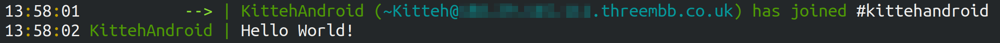

Using KICL on Android
=====================

KICL can be used within an Android application. This requires some configuration, because KICL uses features only available in Java 8:

### Add the library dependency

In `app/build.gradle`:

```groovy
dependencies {
    // ...
    implementation group: 'org.kitteh.irc', name: 'client-lib', version: '5.1.0'
}
```

### Ensure minSdkVersion >= 24

In `app/build.gradle`:

```groovy
android {
    // ...
    defaultConfig {
        applicationId "com.example.kiclandroidtest"
        minSdkVersion 24
        // ...
    }
}
```

### Ensure source and target compatibility are set for Java 8

In `app/build.gradle`:

```groovy
android {
    // ...
    compileOptions {
        sourceCompatibility = '1.8'
        targetCompatibility = '1.8'
    }
}
```

### Filter out duplicate META-INF files

In `app/build.gradle`:

```groovy
android {
    // ...
    packagingOptions {
        exclude 'META-INF/INDEX.LIST'
        exclude 'META-INF/io.netty.versions.properties'
    }
}
```

### Add internet permission

In `AndroidManifest.xml`:

```xml
<manifest xmlns:android="http://schemas.android.com/apk/res/android"
    package="com.example.kiclandroidtest">
    <uses-permission android:name="android.permission.INTERNET"/>
    <!-- ... -->
</manifest>
```

### Write some code

Simple asynchronous task to connect to an IRC network and send a message:

```java
import android.os.AsyncTask;

import org.kitteh.irc.client.library.Client;

public class ConnectIrcTask extends AsyncTask<Void, Void, Void> {
    @Override
    protected Void doInBackground(Void... voids) {
        Client client = Client.builder().nick("KittehAndroid").server().host("localhost").then().buildAndConnect();

        client.addChannel("#kittehandroid");
        client.sendMessage("#kittehandroid", "Hello World!");
        return null;
    }
}
```


And run it somewhere in an activity listener:

```java
FloatingActionButton fab = findViewById(R.id.fab);
fab.setOnClickListener(new View.OnClickListener() {
    @Override
    public void onClick(View view) {
        Snackbar.make(view, "Connecting to IRC", Snackbar.LENGTH_LONG)
                .setAction("Action", null).show();
        new ConnectIrcTask().execute();
    }
});
```

Run the app, and trigger the task:


